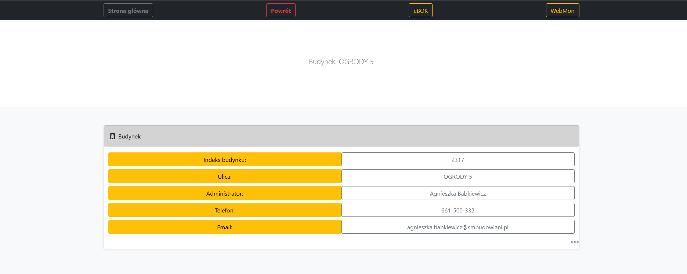

# Dillinger
## _The Last Markdown Editor, Ever_

[](https://nodesource.com/products/nsolid)

[](https://travis-ci.org/joemccann/dillinger)

# Panel Mieszkańca SM Budowlani
> Panel mieszkańca napisany dla mieszkańców. Mieszkaniec otrzymuje od SM kompendium wiedzy na temat nieruchomosci, 
> w której mieszka. 

## Menu
* [Informacje ogólne](#informacje-oglne)
* [Zrzut ekranu](#zrzut-ekranu)
* [Technologie](#technologie)
* [Instalacja](#instalacja)
* [Kod](#kod)
* [Plan rozwoju](#plan-rozwoju)
* [Status](#status)
* [Inspiracje](#inspiracje)
* [Kontakt](#kontakt)

## Informacje ogólne
Dzięki nowemu, rozbudowanemu Panelowi mieszkańca będziecie mogli dowiedzieć się Państwo jaki rodzaj prac remontowych będzie wykonywany w danej lokalizacji, kto jest ich wykonawcą oraz kiedy prace remontowe zostaną rozpoczęte i zakończone. 
Widoczny będzie również stan funduszu remontowego oraz zadłużenie nieruchomości. 
W Panelu mieszkańca będzie można również pobrać niezbędne oświadczenia i wnioski. 
Wszystkie dane przedstawione są w przejrzystej i prostej formule. 

## Zrzut ekranu


## Technologie
* PHP
* HTML 5
* JS
* Bootstrap
* CSS
* XAMP - version 3.2.4

## Instalacja
https://panelmieszkanca.smbudowlani.pl/index.php

## Przykładowy kod


```  <!-- Popper JS -->
  <script src="https://cdnjs.cloudflare.com/ajax/libs/popper.js/1.14.3/umd/popper.min.js"></script>
  <!-- Latest compiled JavaScript -->
  <script src="https://maxcdn.bootstrapcdn.com/bootstrap/4.1.3/js/bootstrap.min.js"></script>
  <link rel="stylesheet" type="text/css" href="https://cdn.datatables.net/v/bs4/dt-1.10.18/datatables.min.css" />

  <script type="text/javascript" src="https://cdn.datatables.net/v/bs4/dt-1.10.18/datatables.min.js"></script>

  <script type="text/javascript" src="https://cdn.jsdelivr.net/momentjs/latest/moment-with-locales.min.js"></script>
</head>

<body>
  <header>
    <div class="collapse bg-dark" id="navbarHeader">
      <div class="container">
```


## Plan rozwoju

* sprawdzanie salda
* panel komunikacji
* panel logowania

## Status
Status projektu: _in progress_, 

## Inspiracje
Projekt autorski.

## Kontakt
Wykonany przez [@ithelparturgolata](ithelparturgolata@gmail.com) 